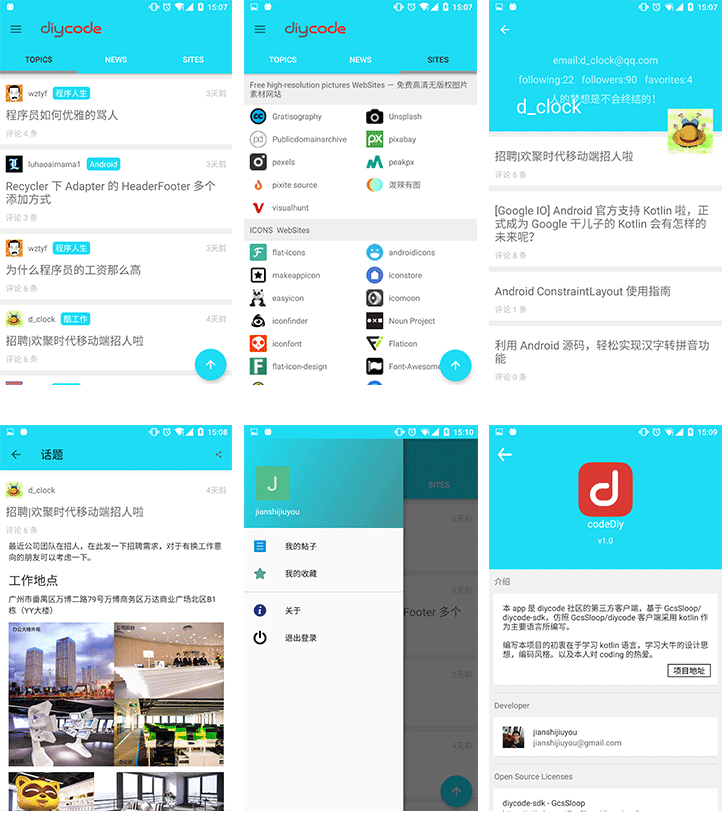

# codediy
本 app 是 [diycode](https://www.diycode.cc/) 社区的第三方客户端，基于 [GcsSloop/diycode-sdk](https://github.com/GcsSloop/diycode-sdk)，仿照 [GcsSloop/diycode](https://github.com/GcsSloop/diycode) 客户端采用 kotlin 作为主要语言所编写。

编写本项目的初衷在于学习 kotlin 语言，学习大牛的设计思想，编码风格。以及本人对 coding 的热爱。

应用下载 [app-debug.apk](http://os6ycxx7w.bkt.clouddn.com/github/app-debug.apk)
# 应用截图

## License
```
Copyright 2017 jianshijiuyou

Licensed under the Apache License, Version 2.0 (the "License");
you may not use this file except in compliance with the License.
You may obtain a copy of the License at

    http://www.apache.org/licenses/LICENSE-2.0

Unless required by applicable law or agreed to in writing, software
distributed under the License is distributed on an "AS IS" BASIS,
WITHOUT WARRANTIES OR CONDITIONS OF ANY KIND, either express or implied.
See the License for the specific language governing permissions and
limitations under the License.
```
